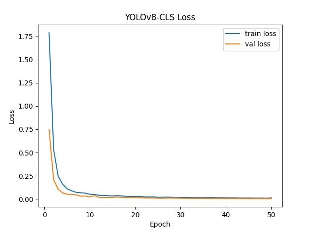
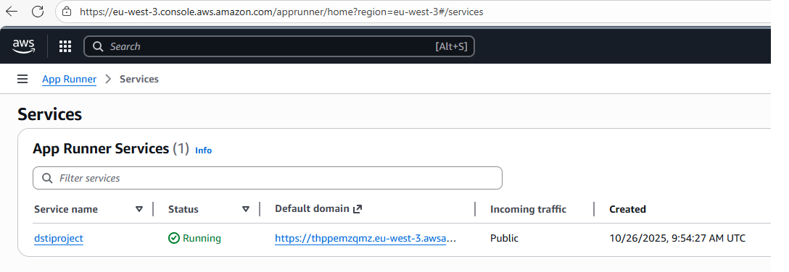

# Deep Learning project at DSTI : computer vision

## Summary

This project consists in fine-tuning a pretrained model in order to predict leaf disease for tomatoes, potatoes and pepper.

- Kaggle dataset : https://www.kaggle.com/datasets/abdallahalidev/plantvillage-dataset

20639 images, 15 categories

- Model : yolov8s-cls

classification version of Ultralytics's YOLOv8


## Dataset preparation : splitting files into /train /validation /test folders

70% of files are for training/validating and the rest are for validation:

```
python image_splitter.py --src "C:\path_to_dataset\Dataset" --dst "C:\path_to_dataset\DatasetYolo" --train 0.70 --val 0.10 --copy
```

## Model training

Just train the model:

```
python train.py
```

- Learning curve:

The model has been trained for 50 epoch : 20 would have been enough !

```
python learning_curve.py
```




## Making inferences

- A small web application has been created using python and gradio (web_app_gradio.py). The app is run within a Docker container which has been deployed as an "AWS App Runner" service:





